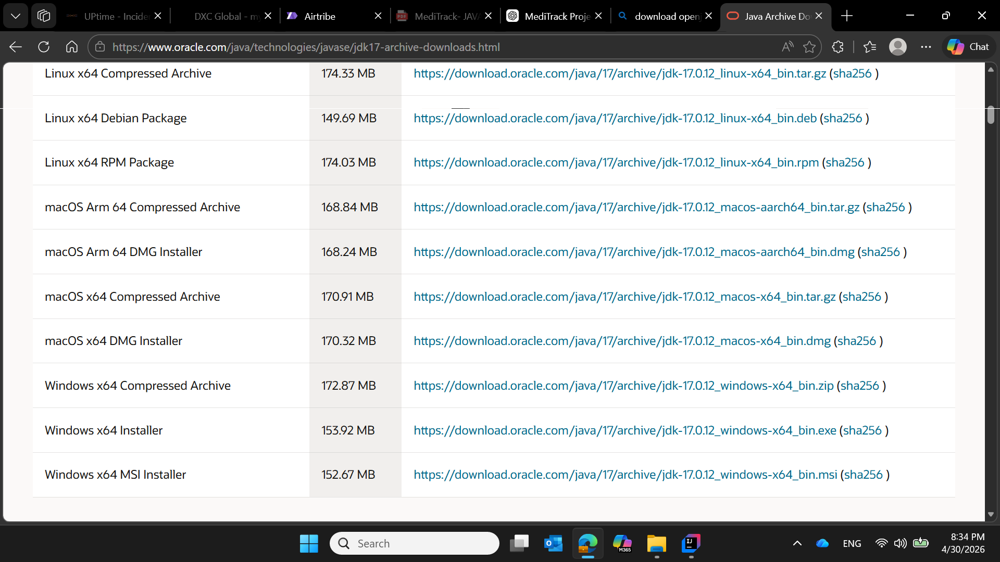
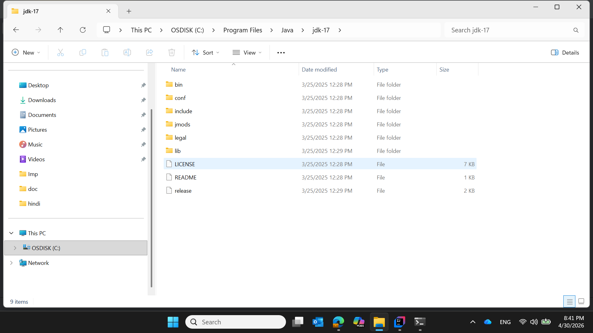
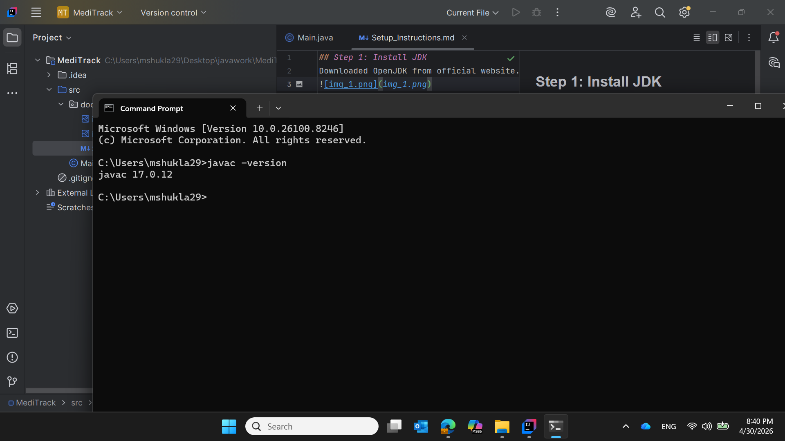
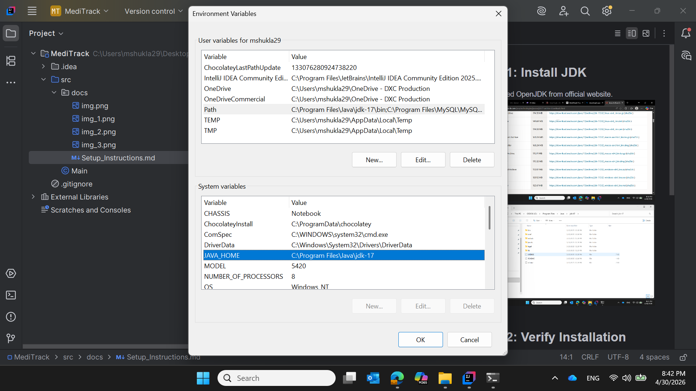
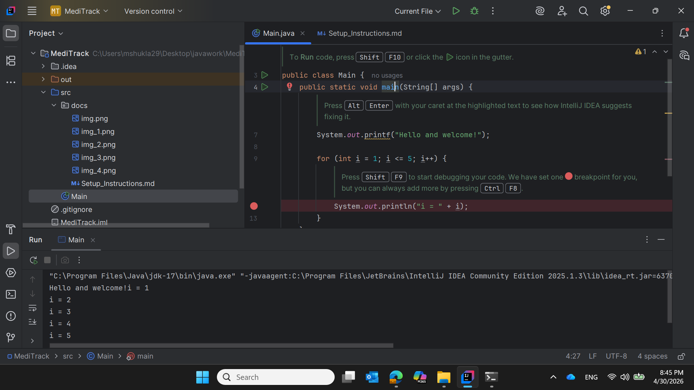

## Step 1: Install JDK
Downloaded OpenJDK from official website.

## Step 2: Verify Installation
Commands used:
java -version
javac -version

## Step 3: Set Environment Variables
Configured JAVA_HOME and updated PATH.

## Step 4: Test Program
Created Main.java and executed successfully.
